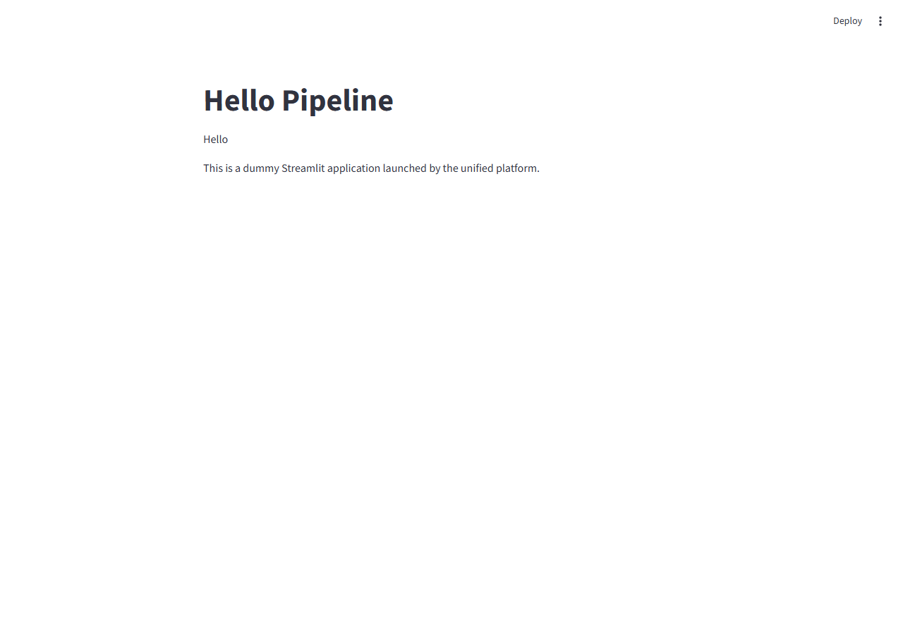
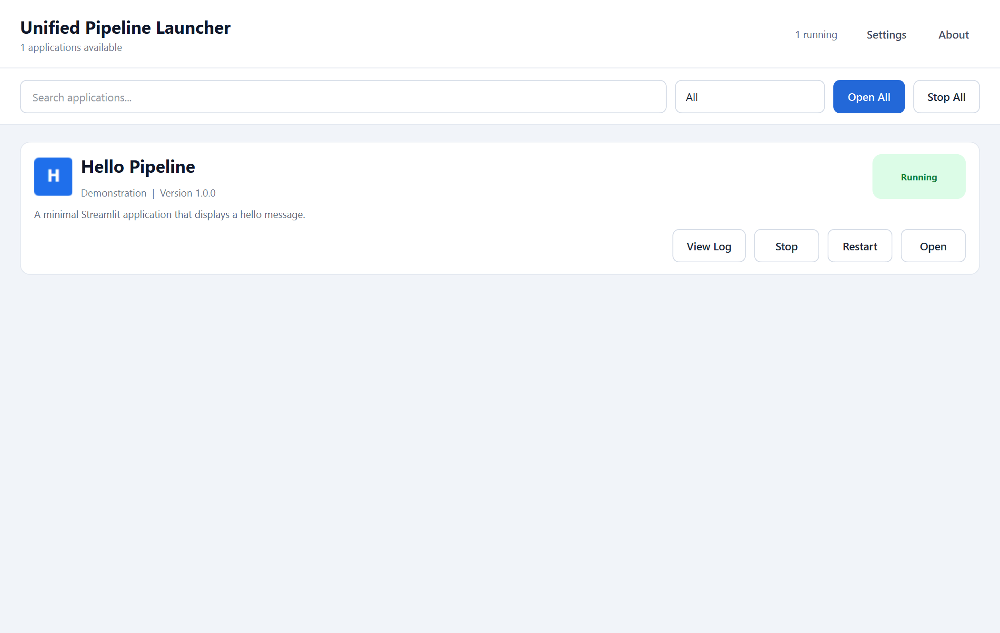

# Executive Summary

**Release-readiness score: 52/100. Production-ready: No.**

The launcher has a clear component model, uses argument-list subprocess calls with `shell=False`, validates manifest paths, supports parallel Streamlit startup, and now has meaningful unit, real-process, browser, native-Qt, performance, security, and build coverage. Actual Chromium, Firefox, and WebKit runs rendered pages and exercised widgets, reruns, refresh, session state, error pages, concurrent apps, crashes, hung scripts, and large output.

The release has three blocking weaknesses. First, the packaged `runtime/python.exe` cannot import Streamlit, while the normal production path skips runtime validation; the generated release therefore opens the desktop shell but cannot launch any registered app until an administrator prepares it. Second, the default configuration uses one shared site-packages tree for every app, so the documented per-app dependency isolation does not exist and conflicting versions cannot be supported. Third, process ownership ends at one tracked `Popen`: nested children survive Stop, and children survive a launcher crash or restart with no reconciliation.

Strong areas are shell-injection resistance, app-root path checks, deterministic localhost binding, independent normal app processes, browser-visible E2E behavior, and the new CI location. Weak areas are deployment completeness, dependency isolation, process-tree ownership, environment isolation, port reservation, application-level readiness, long Windows paths, child-log retention, and cross-process coordination.

Highest risks, in order: unusable bundled runtime; shared dependency contamination; orphaned process trees; inherited secrets; no crash/restart reconciliation; port TOCTOU; false application readiness for import failures; unbounded child logs; long-path launch failure; and non-reproducible dependencies.

Changes made during this audit were deliberately narrow:

- Fixed the unrelated-HTTP-server health false positive by requiring the expected Streamlit log marker and exact `/_stcore/health` body.
- Removed a duplicate log-timer readiness path that could mark a card Running before authoritative startup completed.
- Added startup cancellation so Stop All or window close cannot launch a delayed worker after clearing state.
- Replaced whole-file health/log-dialog reads with bounded tail reads.
- Wrapped malformed config and registry JSON in launcher domain errors.
- Moved CI from `src/.github/workflows` to repository-root `.github/workflows`.
- Added focused unit, integration, browser, native desktop, security, performance, and known-defect tests.

# Architecture

## Actual Process And Dependency Model

```text
launcher.exe / python -m launcher.main
    |
    +-- PySide6 MainWindow (native desktop UI, not a web UI)
    |      |
    |      +-- QThreadPool Worker per startup
    |             |
    |             +-- EnvironmentManager
    |             |      |
    |             |      +-- default: one bundled/shared Python runtime
    |             |      |      +-- one merged site-packages set for all apps
    |             |      |
    |             |      +-- optional: per-app/per-version venv
    |             |
    |             +-- ProcessManager
    |                    |
    |                    +-- python -m streamlit run <absolute app.py>
    |                           cwd=<app directory>
    |                           stdout/stderr=<per-app log file>
    |                           localhost dynamic port
    |                           |
    |                           +-- Streamlit script/session threads
    |                           +-- optional app-created nested processes
    |
    +-- external default browser
           +-- Streamlit HTTP/WebSocket session for App A
           +-- independent Streamlit HTTP/WebSocket session for App B
```

## Launcher Architecture

`launcher.main` resolves configuration, creates local-cache directories, discovers manifests, resolves a Python runtime, then constructs `EnvironmentManager`, `ProcessManager`, and `MainWindow`. The UI queues work through Qt's global `QThreadPool`. The launcher itself is a native PySide6 application; only child Streamlit apps are browser applications.

## Python Isolation Model

The code supports per-app/per-version virtual environments in `EnvironmentManager.ensure_environment`, keyed by app/version, requirements hash, and runtime fingerprint. That path validates `import streamlit`. It is not the default. `src/config/launcher_config.json:21` sets `create_virtual_environments` to false, so `shared_runtime_state` returns the same Python executable and site-packages for every app without checking requirements. `prepare_shared_runtime.ps1` merges all app requirement files and installs them into that one interpreter. Project-local modules remain separated by each process's cwd, which was verified with two same-named `identity.py` files, but third-party version conflicts are not isolated.

## Process Model

`ProcessManager` stores one in-memory `ApplicationRuntimeState` per app ID and retains the direct `Popen`. It starts an argument list with `shell=False`, a fixed loopback address, an allocated port, app cwd, and stdout/stderr merged into a file. Stop sends `terminate`, waits, then sends `kill` on timeout. It does not create a Windows Job Object, POSIX process group/session, persistent PID record, or process identity token. It cannot own descendants or reconcile a surviving server after launcher restart.

## Port Model

`PortManager` binds `127.0.0.1:0`, closes that socket, rebind-checks the chosen port, closes again, and records the integer in a process-local set. Streamlit binds later. This is a classic check-close-use window; another process or launcher instance can acquire the port. The fixed health check now prevents an unrelated 200 response from being accepted as the launched app, but it cannot eliminate the allocation race.

## Environment Model

The child receives a copy of the complete launcher environment. Only `PYTHONPATH`, `PYTHONHOME`, `PYTHONSTARTUP`, and `PYTHONUSERBASE` are removed; `PYTHONNOUSERSITE=1` is added. A live browser fixture confirmed an arbitrary `LAUNCHER_AUDIT_SECRET` reaches the child. The child uses the selected interpreter, app cwd, and normal Python cwd-based import behavior.

## Filesystem And Logging Model

Registry and manifest paths are resolved and required to remain within approved roots. Absolute paths and `..` components are rejected. Each app log is truncated on launch and receives combined stdout/stderr. Launcher logs rotate, but child logs do not. Health polling and the log dialog now read only bounded tails (8 KB and 120 KB); disk growth remains unbounded.

## Shutdown Model

Normal launcher exit calls `stop_all`. UI Stop All and window close now signal every in-flight startup before clearing UI state, and a worker checks cancellation both before and after process creation. Direct children normally release ports shortly after Stop All. App-created descendants, children after a launcher crash, and children from a previous launcher instance are outside ownership.

# Test Environment

| Component | Version / Value |
| --- | --- |
| Host | Windows 11, `Windows-11-10.0.26200-SP0` |
| Audit Python | 3.12.10, `D:\pythonProject\HRI\Streamlit_Launcher\.venv\Scripts\python.exe` |
| Bundled runtime | CPython 3.11.9; Streamlit and PySide6 absent |
| Streamlit | 1.58.0 |
| PySide6 | 6.11.1 |
| pytest | 9.0.3 |
| pytest-cov / coverage.py | 7.15.4 |
| Python Playwright | 1.62.0 |
| Playwright CLI | 1.62.1 |
| Browsers | Chrome for Testing 151.0.7922.34, Firefox 153.0, WebKit 26.5 |
| psutil | 7.2.2 |
| Bandit | 1.9.4 |
| pip-audit | 2.10.1 |
| Trailmark | 0.5.0 |
| Build | PyInstaller 6.20.0 |

Audit-only tools were installed into the existing `.venv`; project requirement files were not changed for those tools. No third-party skill script was executed.

# Test Matrix

| ID | Area | Scenario | Expected | Actual | Status |
| -- | ---- | -------- | -------- | ------ | ------ |
| L-01 | Launch | One real Streamlit app | Healthy/rendered | 1.103 s; 3-process tree; 68.29 MiB | PASS |
| L-02 | Launch | Two apps concurrently | Independent ports/processes/imports | 1.081 s wall; 136.94 MiB total | PASS |
| L-03 | Launch | Five apps concurrently | Five healthy unique ports | 1.327 s wall; 343.58 MiB total | PASS |
| L-04 | Launch | Same app started twice | One process/state | One `Popen` call | PASS |
| L-05 | Lifecycle | 20 launch/stop cycles | No process/port leak | 0 -> 0 children; all ports reusable | PASS |
| L-06 | Lifecycle | Stop All during environment setup | No delayed process | Cancellation prevented `start` | FIXED/PASS |
| L-07 | Lifecycle | New manager after launcher restart | Reconcile existing child | New manager sees nothing | XFAIL/BUG |
| P-01 | Ports | Dynamic free port | Bind and become healthy | Healthy on allocated localhost port | PASS |
| P-02 | Ports | Five simultaneous allocations | Unique ports | Five unique ports | PASS |
| P-03 | Ports | Unrelated HTTP server owns selected port | Reject wrong server | Initially accepted 3/3; now rejected | FIXED/PASS |
| P-04 | Ports | Release after five-app Stop All | Rebind available | All available after 58 ms | PASS |
| P-05 | Ports | TOCTOU check-close-use | Atomic reservation | Socket is closed before Streamlit bind | OPEN RISK |
| D-01 | Dependencies | Same local module name in two apps | A/B remain distinct | Browser showed Identity A and B | PASS |
| D-02 | Dependencies | Child executable and cwd | Selected Python/app cwd | Verified in process and browser | PASS |
| D-03 | Dependencies | Scrub Python contamination vars | Vars absent | Four vars absent; `PYTHONNOUSERSITE=1` | PASS |
| D-04 | Dependencies | Arbitrary environment secret | Secret isolated | Secret visible in child page | FAIL/BUG |
| D-05 | Dependencies | Conflicting third-party versions | Per-app isolation | Default merges requirements into one runtime | FAIL/ARCHITECTURE |
| D-06 | Dependencies | Missing import | Error surfaced without launcher crash | Browser rendered `ModuleNotFoundError` | PASS, readiness concern |
| F-01 | Paths | Spaces/Unicode/`()#&';` | Discover and launch | Real launch succeeded | PASS |
| F-02 | Paths | Double quote in folder | Safe handling | Illegal Windows filename, not executable | NOT APPLICABLE ON WINDOWS |
| F-03 | Paths | Path longer than 260 chars | Launch | `WinError 267` for `cwd` | XFAIL/BUG |
| F-04 | Paths | `../` traversal and absolute escape | Reject | Rejected | PASS |
| F-05 | Paths | Symlink escape | Reject | Windows token could not create symlink | SKIPPED |
| C-01 | Chaos | Child exits with code 7 | Launcher survives/untracks | Survived; state removed | PASS |
| C-02 | Chaos | Infinite Streamlit script | Stop remains effective | Browser triggered hang; stop succeeded | PASS |
| C-03 | Chaos | 2 MiB stdout + 2 MiB stderr | No pipe deadlock | Page rendered; log >=4 MiB | PASS |
| C-04 | Chaos | Child refuses terminate | Kill fallback | Deterministic timeout fixture killed | PASS (unit) |
| C-05 | Chaos | App spawns nested subprocess | Stop entire tree | Nested child survived | XFAIL/BUG |
| C-06 | Chaos | Launcher crashes with app alive | No orphan | Streamlit listener survived Qt test crash | FAIL/BUG |
| B-01 | Browser | Text input and Enter rerun | Updated output | `Hello Ada` rendered | PASS, 3 engines |
| B-02 | Browser | Button/session rerun | Count increments | `Count: 1` rendered | PASS, 3 engines |
| B-03 | Browser | Hard refresh | Defined session behavior | New session rendered `Count: 0` | OBSERVED/PASS |
| B-04 | Browser | Broken app page | Visible error | `ModuleNotFoundError` visible | PASS, 3 engines |
| B-05 | Browser | Two apps independently | Correct identity per tab | Correct A/B identity and cwd | PASS |
| UI-01 | Native UI | Click Open card | Real child reaches Running | Qt E2E passed; screenshot captured | PASS |
| UI-02 | Native UI | Duplicate readiness events | Browser opens once | One open per launch token | PASS |
| UI-03 | Native UI | Coverage-instrumented full suite | Stable test | One native access violation; 5 isolated reruns passed | FLAKY |
| S-01 | Security | Shell metacharacter paths | No command execution | `shell=False`; fixture launched literally | PASS |
| S-02 | Security | Command fields in manifest | Reject | Rejected | PASS |
| S-03 | Security | Static scan | No high findings | 0 high, 2 medium, 13 low | REVIEWED |
| R-01 | Release | Public quality gate/full build | Tests/build/verify pass | 85 passed, 2 xfailed; build verified | PASS |
| R-02 | Release | Packaged launcher smoke | Desktop process stays alive | Alive after 5 seconds | PASS |
| R-03 | Release | Packaged runtime can run Streamlit | Version command succeeds | `No module named streamlit`, exit 1 | FAIL/BLOCKER |
| R-04 | CI | GitHub discovers workflow | Root `.github/workflows` | Was under `src`; moved to root | FIXED/PASS |

# Tests Executed

Commands below are relative to repository root unless a `cd src` prefix is shown.

```powershell
# Validate all 32 repository skills.
$skills = Get-ChildItem .agents\skills -Directory
$skills | ForEach-Object { Test-Path (Join-Path $_.FullName 'SKILL.md') }

# Static code graph and complexity.
.venv\Scripts\trailmark.exe analyze --language auto --summary src\launcher
.venv\Scripts\trailmark.exe complexity src\launcher --threshold 8
.venv\Scripts\trailmark.exe entrypoints src\launcher

# Baseline tests and branch coverage.
cd src
..\.venv\Scripts\python.exe -m pytest -q --cov=launcher --cov=build_scripts --cov-branch --cov-report=term-missing

# Focused real-process, browser, and native launcher suites.
..\.venv\Scripts\python.exe -m pytest -q tests\test_runtime_integration.py tests\test_browser_e2e.py tests\test_main_window_launch_flow.py
$env:QT_QPA_PLATFORM='windows'
$env:LAUNCHER_AUDIT_SCREENSHOT='..\audit_artifacts\launcher-running-windows.png'
..\.venv\Scripts\python.exe -m pytest -q tests\test_desktop_launcher_e2e.py

# Browser installation and cross-engine E2E.
..\.venv\Scripts\python.exe -m playwright install chromium firefox webkit
..\.venv\Scripts\python.exe -m pytest -q tests\test_browser_e2e.py::test_streamlit_widgets_rerun_refresh_and_error_rendering

# CLI browser screenshot against a real launched app (audit run used port 56448).
npx playwright screenshot --browser chromium --viewport-size 1280,900 --wait-for-selector h1 http://127.0.0.1:56448 ..\audit_artifacts\hello-pipeline-chromium.png

# Opt-in performance and lifecycle probes.
$env:RUN_PERFORMANCE_AUDIT='1'
..\.venv\Scripts\python.exe -m pytest -q -s tests\test_performance_audit.py

# Security and dependency checks.
..\.venv\Scripts\python.exe -m bandit -r launcher build_scripts -f screen
..\.venv\Scripts\python.exe -m pip_audit -r requirements-build.txt

# Reliable non-E2E branch coverage; browser/native E2E is run separately.
..\.venv\Scripts\python.exe -m pytest -q -m "not e2e" --cov=launcher --cov=build_scripts --cov-branch --cov-report=term-missing

# Public build and release verification.
.\scripts\public_quality_gate.ps1 -FullBuild

# Packaged runtime capability check.
.\build\Unified-Streamlit-Launcher\runtime\python.exe -m streamlit --version
```

Important outcomes:

- Final normal suite: 88 passed, 2 skipped, 3 strict known-defect xfails in 41.38 seconds.
- Reliable non-E2E branch coverage: 66%, 78 passed, 2 skipped, 2 xfailed at measurement time.
- Three-engine browser matrix: 3 passed in 21.00 seconds.
- Targeted real-process/browser/Qt suite: 15 passed, 1 xfailed in 39.21 seconds before later focused additions.
- Bandit: 0 high, 2 medium, 13 low. Both medium findings are generic `urlopen` checks; one is fixed localhost health traffic and one is an administrator-configured runtime URL with SHA-256 verification.
- `pip-audit -r requirements-build.txt`: no known vulnerabilities in the dependency set resolved on 2026-08-12. The result is not reproducible without a lockfile.
- Trailmark: 721 nodes, 119 functions, 44 classes, 532 proxy/unresolved nodes, 1,062 call edges, and one entry point. `ProcessManager.start` had the highest reported complexity (11). Graph results were treated as orientation, not proof of security.

# Bugs Found

## BUG-001 - Packaged Runtime Cannot Launch Streamlit

- **Severity:** HIGH / P0 release blocker
- **Affected:** `src/config/launcher_config.json:13`, `src/launcher/main.py:98-108`, packaged `src/runtime/python.exe`
- **Function/class:** `main`, `RuntimeResolver.resolve`
- **Reproduction:** Run the full build, then execute `build\Unified-Streamlit-Launcher\runtime\python.exe -m streamlit --version`.
- **Expected:** Bundled runtime reports the packaged Streamlit version.
- **Actual:** Exit 1, `No module named streamlit`. The packaged desktop executable itself remained alive for five seconds.
- **Evidence/root cause:** The checked-in runtime is bare CPython 3.11.9. With `sync_to_local_cache=false`, production calls `resolve(validate=False)` and does not run the later validation branch. Release verification checks file structure, not imports or a child-app launch.
- **Recommended fix:** Make release preparation install locked dependencies, validate PySide6/Streamlit in the exact packaged runtime, and launch a smoke fixture as a build gate. Fail packaging if any step fails.
- **Regression test:** Build artifact test that starts one child with the packaged runtime and renders a browser assertion.

## BUG-002 - Default Configuration Does Not Isolate Third-Party Dependencies

- **Severity:** HIGH / P0 architecture mismatch
- **Affected:** `src/config/launcher_config.json:21`, `src/launcher/environment_manager.py:147-172`, `src/scripts/prepare_shared_runtime.ps1:87-168`
- **Function/class:** `EnvironmentManager.shared_runtime_state`, `ensure_environment`
- **Reproduction:** Inspect the default config and prepare script; launch two apps and capture `sys.executable`.
- **Expected:** Each app can use its own conflicting package version without contaminating another app or the launcher.
- **Actual:** Every app receives the same runtime and shared site-packages. The preparation script merges all requirements into one pip transaction.
- **Evidence/root cause:** The implemented venv path is disabled by default. Local same-name source modules stayed distinct due to cwd, but third-party dependency conflicts cannot be represented in one environment.
- **Recommended fix:** Enable per-app/per-version venvs by default, lock each app's transitive dependencies, add cross-process creation locks, and keep the launcher runtime separate from child runtimes.
- **Regression test:** Build two local wheels with the same import and conflicting versions; render each version in simultaneous child apps and verify launcher imports are unchanged.

## BUG-003 - Stop Does Not Own The Full Process Tree

- **Severity:** HIGH / P0
- **Affected:** `src/launcher/process_manager.py:136-157`
- **Function/class:** `ProcessManager.stop`
- **Reproduction:** Run `test_stopping_streamlit_also_stops_its_nested_child`.
- **Expected:** Stopping an app terminates every process created by that app.
- **Actual:** The nested Python process remains alive. The strict xfail cleans it explicitly.
- **Evidence/root cause:** Only the direct `Popen` receives terminate/kill. There is no Windows Job Object or POSIX process group.
- **Recommended fix:** Assign every app tree to a kill-on-close Windows Job Object; on POSIX start a new session and terminate/kill its process group. Verify process creation time before any PID-only fallback.
- **Regression test:** Existing strict xfail should become a pass on Windows and POSIX.

## BUG-004 - Child Apps Inherit Unrelated Secrets

- **Severity:** HIGH / P1 security boundary
- **Affected:** `src/launcher/process_manager.py:61-66`
- **Function/class:** `ProcessManager.start`
- **Reproduction:** Set `LAUNCHER_AUDIT_SECRET=visible-to-child`, launch the identity fixture, and open it in Chromium.
- **Expected:** Unrelated launcher/user secrets are absent unless explicitly allowlisted.
- **Actual:** Browser rendered `Secret: visible-to-child`.
- **Evidence/root cause:** `os.environ.copy()` is used, then only four Python variables are removed.
- **Recommended fix:** Construct a minimal child environment allowlist, with explicit configured pass-through variables and secret redaction in diagnostics.
- **Regression test:** Assert deny-by-default plus explicit allowlist behavior in a real process.

## BUG-005 - Launcher Crash/Restart Leaves Unmanaged Servers

- **Severity:** HIGH / P1
- **Affected:** `src/launcher/process_manager.py:27`, `src/launcher/main.py:128`
- **Function/class:** `ProcessManager` registry/lifecycle
- **Reproduction:** Start a child, create a new manager or terminate the launcher unexpectedly.
- **Expected:** A new launcher reconciles or safely adopts/stops its owned server; abnormal exit has OS-enforced cleanup.
- **Actual:** A new manager reports no state. During the coverage-triggered Qt crash, audit-owned PIDs 26708/16644 continued listening on port 63268 until explicitly cleaned.
- **Evidence/root cause:** State exists only in a Python dictionary; no job object, lockfile, PID metadata, health identity, or startup reconciliation exists.
- **Recommended fix:** Combine OS process-tree containment with atomically written ownership metadata and startup reconciliation. Do not trust PID alone.
- **Regression test:** Existing restart xfail plus a crash harness that kills the launcher and asserts no listener remains.

## BUG-006 - Port Allocation Has A TOCTOU Window

- **Severity:** MEDIUM / P1
- **Affected:** `src/launcher/port_manager.py:17-37`, `src/launcher/process_manager.py:57-70`
- **Function/class:** `PortManager.get_available_port`, `ProcessManager.start`
- **Reproduction:** The code binds port 0, closes it, rebind-checks, closes again, then starts Streamlit. The occupied-port fixture forced another server into the selected slot.
- **Expected:** The selected port is exclusively transferred to the child or bind collision is safely retried.
- **Actual:** The integer is only reserved in memory. Before the health fix an unrelated server was accepted 3/3. It is now rejected, but startup still fails instead of retrying a bind race.
- **Evidence/root cause:** A TCP port cannot be reserved by retaining only its number.
- **Recommended fix:** Prefer child port 0 with authoritative port discovery if Streamlit supports it; otherwise retry startup on proven bind failure and coordinate launcher instances. Never accept root HTTP 200 as identity.
- **Regression test:** Deterministically steal the selected port between allocation and `Popen`, assert bounded retry and correct process identity.

## BUG-007 - Server Health Is Not Application Health

- **Severity:** MEDIUM / P1
- **Affected:** `src/launcher/health_checker.py:34-66`, Streamlit execution model
- **Function/class:** `HealthChecker.wait_until_healthy`
- **Reproduction:** Launch an app containing `import definitely_missing_audit_package`, then open its URL.
- **Expected:** Card communicates that the application script failed.
- **Actual:** Streamlit server health succeeds and the browser renders `ModuleNotFoundError`; the launcher can label the server Running.
- **Evidence/root cause:** Streamlit starts its server before executing an app script for a browser session. `/_stcore/health` proves server health only.
- **Recommended fix:** Add a launcher/app handshake or post-session health signal that executes/imports the app, while preserving visible error details.
- **Regression test:** Broken-import fixture must transition to Failed or a distinct `Server running / app failed` state.

## BUG-008 - Child Logs Grow Without Rotation

- **Severity:** MEDIUM / P1
- **Affected:** `src/launcher/process_manager.py:58-69`
- **Function/class:** `ProcessManager.start`
- **Reproduction:** The large-output fixture wrote 4 MiB and continued to render. A continuously printing app would keep extending the same file.
- **Expected:** Configured limits bound disk use and preserve useful diagnostics.
- **Actual:** App log is a raw file opened in write mode and has no max size, backups, or retention. Launcher logging limits do not apply.
- **Evidence/root cause:** Child stdout/stderr are redirected directly to one file handle. This avoids pipe deadlock but bypasses rotating handlers.
- **Recommended fix:** Use a supervised drain into rotating files or a rotation design safe for an inherited child handle; enforce total retention per app.
- **Regression test:** Continuous bounded-duration writer crosses the threshold, remains responsive, and total retained bytes stay within policy.

## BUG-009 - Windows Long App Paths Fail At Process Creation

- **Severity:** MEDIUM / P1
- **Affected:** `src/launcher/process_manager.py:70-79`
- **Function/class:** `ProcessManager.start`
- **Reproduction:** Run `test_real_launch_handles_a_long_app_path` with an app entrypoint path over 260 characters.
- **Expected:** Existing long path launches or fails validation with a clear supported-length message.
- **Actual:** `ApplicationStartError: [WinError 267] The directory name is invalid` when the path is used as `cwd`.
- **Evidence/root cause:** Windows `CreateProcess` path semantics are not normalized to an extended path and no path-length validation exists.
- **Recommended fix:** Test and consistently apply supported extended-length paths, or reject unsupported paths during discovery with a precise diagnostic.
- **Regression test:** Existing strict xfail should become pass or a deterministic validation-error test.

## BUG-010 - Runtime/Launch Manifest Settings Are Partly Ignored

- **Severity:** MEDIUM / P1
- **Affected:** `src/launcher/process_manager.py:29-49`, `src/launcher/app_discovery.py:103-119`
- **Function/class:** `ProcessManager.build_command`
- **Reproduction:** Configure non-default `headless`, `gather_usage_stats`, `address`, `port`, or a different `python_version`.
- **Expected:** Supported values affect launch; unsupported values are rejected.
- **Actual:** Address/headless/usage/port are hardcoded; only file watcher and startup timeout materially affect launch. `python_version` is recorded but not enforced.
- **Evidence/root cause:** Parsed manifest fields are not used in command construction or runtime validation.
- **Recommended fix:** Either honor the contract safely or remove unsupported fields and validate `python_version` against the selected interpreter.
- **Regression test:** Parameterized command/runtime tests for every public manifest field.

## BUG-011 - Environment And Cache Preparation Lack Cross-Process Locking

- **Severity:** MEDIUM / P1
- **Affected:** `src/launcher/environment_manager.py:175-229`, local-cache staging/update paths
- **Function/class:** `EnvironmentManager.ensure_environment`, `LocalCacheManager`
- **Reproduction:** Static concurrency review; one `EnvironmentManager` lock cannot coordinate two launcher processes.
- **Expected:** Two launcher instances cannot concurrently recreate the same venv or shared cache target.
- **Actual:** No filesystem lock or unique per-attempt venv staging path protects cross-process writes.
- **Evidence/root cause:** Coordination is process-local. This was inferred from code; a destructive concurrent pip-install test was not run against the real cache.
- **Recommended fix:** Use per-target lockfiles with owner metadata/timeouts and build into a unique staging directory followed by atomic promotion.
- **Regression test:** Two subprocess launchers race the same fixture environment; exactly one build occurs and both consume a valid final marker.

## BUG-012 - Release Icon Is Invalid

- **Severity:** LOW / P2
- **Affected:** `src/assets/launcher/launcher.ico`, PyInstaller spec generation
- **Function/class:** release build
- **Reproduction:** Run `.\scripts\public_quality_gate.ps1 -FullBuild`.
- **Expected:** Launcher executable receives the intended icon without warnings.
- **Actual:** Build warns `ignoring invalid launcher icon` and uses the default executable icon.
- **Recommended fix:** Replace the asset with a valid multi-resolution ICO and assert the icon resource in build verification.
- **Regression test:** Validate ICO structure before PyInstaller and inspect the built executable resource.

## BUG-013 - Full Coverage Run Has Intermittent Native Qt Access Violation

- **Severity:** LOW / P2 test reliability
- **Affected:** `src/tests/test_desktop_launcher_e2e.py:47`, shared in-process Qt test environment
- **Function/class:** native E2E event loop
- **Reproduction:** Full suite under coverage produced a Windows access violation in `qt_app.processEvents` after browser tests. Five isolated coverage runs passed.
- **Expected:** Deterministic desktop E2E.
- **Actual:** One native crash, not reproduced in five fresh processes or two full normal build-gate runs.
- **Evidence/root cause:** Timing/inter-test/native Qt interaction is likely; root cause is not proven. The crash also demonstrated missing OS cleanup for children.
- **Recommended fix:** Run native Qt E2E in a dedicated pytest subprocess/job, always kill its process tree in the parent harness, and retain crash dumps.
- **Regression test:** Repeat dedicated E2E 20 times under coverage and fail on crash or leftover listener.

# Security Findings

## Positive Controls

- Streamlit commands are lists and use `shell=False`; hostile-looking legal Windows path characters were passed literally.
- Manifest app IDs are constrained; command-like fields are rejected.
- Relative path traversal and absolute entrypoint escape are rejected after resolution.
- `PYTHONPATH`, `PYTHONHOME`, `PYTHONSTARTUP`, and `PYTHONUSERBASE` are removed and user site packages are disabled.
- RuntimeDownloader requires a configured SHA-256 and verifies downloaded bytes before extraction.
- Health traffic is fixed to `127.0.0.1` and now requires an exact `ok` body.
- Direct declared requirements resolved with no known advisory in the audit snapshot.

## Open Security Risks

| Severity | Risk | Evidence | Recommendation |
| --- | --- | --- | --- |
| HIGH | Environment secret leakage | Live child rendered arbitrary parent env value | Minimal allowlist and explicit pass-through |
| HIGH | Shared dependency/runtime trust | All app requirements install into one interpreter | Separate locked child environments and launcher runtime |
| MEDIUM | Arbitrary app code boundary | Discovered Streamlit source executes with user privileges | Signed/approved app registry, integrity checks, least-privilege OS account where needed |
| MEDIUM | Dependency confusion | Requirements are ranges and no lock/hash policy exists | Internal index policy, lockfiles, hashes, offline wheelhouse provenance |
| MEDIUM | `fetch_runtime.ps1` lacks artifact hash verification | Downloads NuGet package then extracts/replaces runtime | Pin SHA-256 or signed provenance before extraction |
| LOW | Runtime ZIP containment check uses string prefix | `runtime_downloader.py:134` | Replace with `Path.relative_to` containment check |
| LOW | Symlink escape dynamic test unavailable | Windows token denied symlink creation | Run in CI with Developer Mode/admin and preserve existing resolve checks |

Bandit's two medium URL findings were reviewed: the health URL is internally constructed localhost HTTP; the runtime URL is configured by an administrator and the Python downloader verifies SHA-256. The PowerShell bootstrap path is less strict and should be hardened.

# Concurrency / Process Findings

- Five simultaneous starts completed on five unique ports. Per-app launch times were 1.279-1.325 seconds in the final measurement.
- Two simultaneous apps remained independently stoppable. Stopping app A did not stop app B.
- Duplicate same-app starts inside one manager are serialized by an `RLock` and return the existing state.
- UI startup queueing is bounded by `maximum_parallel_startups`; Stop All now cancels workers before and after process creation.
- The port allocator's Python set is not locked, but current `ProcessManager.start` holds its manager lock during allocation. Different launcher instances remain uncoordinated.
- `ProcessManager.start` releases its lock during health polling; a second direct caller can receive the existing STARTING state before URL readiness. UI duplicate prevention masks this in the current flow, but the public method contract is ambiguous.
- Normal five-app Stop All returned in 6 ms; every listener became rebindable within 58 ms. The final test waits for OS-level release rather than assuming immediate reuse.
- Twenty rapid cycles used 20 unique ports, took 19.07 seconds total (0.953 seconds mean), and ended with zero recursive child processes.
- A hung app script could be stopped. A deterministic terminate-timeout fixture exercised the kill fallback.
- A nested subprocess remained alive after app stop. A launcher crash left its Streamlit tree/listener alive. A new manager cannot reconcile it.
- PID reuse is not explicitly defended if future persistence uses PID alone. Current in-memory `Popen` handles avoid wrong-PID termination during a live launcher, but no durable ownership exists.
- Ctrl+C was not exercised because the release is a windowed GUI executable; normal UI close and Stop All were exercised.

# Cross-Platform Findings

## Actually Tested

Windows 11 only. Source mode, native PySide6 UI, PyInstaller Windows release, dynamic localhost sockets, real subprocesses, special Windows-safe filenames, long paths, and Chromium/Firefox/WebKit browser engines were exercised.

## Inferred From Code, Not Tested

- **Linux:** `creationflags=0` and argument-list process startup should be syntactically valid. Direct `terminate` maps to SIGTERM, but no process group is created, so nested descendants remain a risk. PowerShell deployment scripts, VBS/BAT launchers, Windows runtime paths, and EXE packaging make the shipped release Windows-specific.
- **macOS:** The generic Python subprocess path may run in source mode, but there is no app bundle, signing/notarization, macOS runtime packaging, or process-group handling. Not production-supported by evidence.
- **Filesystem semantics:** Case sensitivity, executable permissions, symlink behavior, POSIX signal behavior, and path separators were not dynamically tested outside Windows.

No claim is made that Linux or macOS works.

# Performance Findings

Measurements are single-host audit samples, not statistical benchmarks.

| Measurement | Result |
| --- | ---: |
| Native launcher window construction/show | 0.085 s |
| One app startup | 1.103 s |
| One app process tree | 3 processes, 68.29 MiB |
| Two concurrent apps startup | 1.081 s wall |
| Two app trees memory | 136.94 MiB |
| Five concurrent apps startup | 1.327 s wall |
| Five per-app startup range | 1.279-1.325 s |
| Five app trees | 3 processes each |
| Five app trees memory | 343.58 MiB total; 68.52-68.95 MiB each |
| Five app idle CPU sample | Four at 0%; one at 3.1% |
| Stop All direct return | 0.006 s |
| Five ports reusable | 0.058 s from cleanup start |
| Twenty start/stop cycles | 19.07 s total; 0.953 s mean |
| Parent RSS before/after cycles | 41.86 MiB -> 44.82 MiB |
| Recursive child count before/after | 0 -> 0 |
| 64 MiB health-log scan before fix | 0.141 s; 192.01 MiB peak Python allocation |
| 64 MiB health-log scan after fix | 0.019 s; 0.02 MiB peak Python allocation |
| Large output | 4 MiB combined stdout/stderr; app still rendered |
| Full test/build gate | 273.7 s, including two full test runs and PyInstaller |

The parent RSS increase of 2.96 MiB after 20 cycles is not enough by itself to establish a leak; allocator/cache warm-up was not separated from retained memory. A longer soak and multiple repetitions are recommended. Child-log disk usage is unbounded even though read-time memory is now bounded.

# Test Coverage Gaps

- Reliable non-E2E branch coverage measured 66%. `launcher.main`, launcher logging setup, executable entrypoint, and most build orchestration remain at or near 0% Python coverage despite external build execution.
- Browser/native E2E is intentionally separate from coverage after one intermittent native Qt access violation.
- No Linux or macOS runtime was available.
- Symlink creation was denied by the Windows token; dynamic symlink escape was skipped.
- Double quotes, `?`, `*`, `<`, `>`, and `|` are illegal Windows filename characters and could not be folder tests.
- No real conflicting third-party wheels, nested package version matrix, global-module shadow fixture, or hashed lockfile was built. The shared-runtime impossibility is proven by architecture and common `sys.executable`, while project-local same-name module isolation was dynamically tested.
- Continuous output, CPU saturation, memory exhaustion, a child binding a second port, file descriptor exhaustion, network-drive disconnects, low disk, antivirus interference, and power loss were not executed.
- No destructive concurrent pip installation was run against the user's real cache. Cross-process lock risk is inferred from code.
- No Ctrl+C console test, PID reuse simulation, Windows service/session boundary, multi-user desktop session, or privilege-drop test was run.
- No signed update package, real update server, TLS interception, or malicious wheel execution was tested.
- Packaged launcher UI buttons were not automated through Windows UI Automation. The EXE process smoke passed; source native UI and child browser behavior were tested independently.
- Performance figures are one machine/one run and have no confidence intervals or regression budgets.

# Architecture Recommendations

1. Separate launcher and child trust domains. Keep a minimal immutable launcher runtime; provision one locked environment per app/version and never merge arbitrary app requirements into the launcher interpreter.
2. Make a runnable artifact, not directory presence, the release gate. Validate imports and launch/render a packaged smoke app using the exact copied runtime.
3. Own process trees at the OS boundary. Use Windows Job Objects with kill-on-close and POSIX sessions/process groups, then add durable ownership metadata for diagnostics/reconciliation.
4. Replace implicit full-environment inheritance with a documented allowlist and explicit per-app environment configuration.
5. Treat server health and application health as separate states. Preserve Streamlit error visibility while reporting app-script failure accurately.
6. Redesign port startup around bind ownership or bounded retry after confirmed collision. Include multiple launcher processes in the concurrency model.
7. Add filesystem locks and unique staging directories for environment/cache creation, with atomic promotion and recovery from abandoned work.
8. Rotate and retain child logs under a total disk budget. Keep bounded tail reads and expose PID, port, interpreter, cwd, exit code, and failure phase in diagnostics.
9. Define supported path length/platform behavior and enforce it during discovery with actionable errors.
10. Lock dependencies and runtime artifacts with hashes/provenance; scan the lock in CI and produce an SBOM for the release.

# Prioritized Changes

## P0 - Must Fix

- Make the packaged runtime import Streamlit/PySide6 and pass a real child launch/render smoke before release.
- Enable genuine per-app dependency isolation or explicitly reject conflicting app requirements; keep child packages out of the launcher runtime.
- Implement process-tree ownership and kill-on-launcher-exit/crash semantics.

## P1 - Should Fix Before Release

- Allowlist child environment variables and prevent secret inheritance.
- Add crash/restart ownership metadata and reconciliation.
- Close the port TOCTOU gap with bind ownership or retry on proven collision.
- Distinguish Streamlit server health from app-script health.
- Add child-log rotation/retention.
- Support or clearly reject Windows long paths.
- Enforce `python_version` and resolve ignored launch settings.
- Add cross-process environment/cache locks and atomic staging.
- Lock/hash dependencies and verify the PowerShell runtime download.

## P2 - Worthwhile Improvement

- Isolate native Qt E2E in its own supervised process and preserve crash dumps.
- Replace the invalid launcher ICO.
- Add structured lifecycle logs with launch token, PID tree, port, cwd, interpreter, phase, elapsed time, and exit code.
- Raise branch coverage for `main`, logging setup, dialogs, and build orchestration.
- Add a release smoke workflow on both Python 3.11 and 3.12 artifacts.

## P3 - Optional Refactoring

- Remove or implement manifest fields that are currently decorative.
- Replace the runtime ZIP string-prefix containment check with `relative_to`.
- Split large UI methods only where added state-machine tests justify it.
- Reorganize tests into unit/integration/e2e directories when suite scale makes marker-only organization hard to navigate.

# Skills Used

All 32 requested repository-scoped skill directories existed and contained a `SKILL.md`. Every file below was read before dynamic testing. No arbitrary bundled skill script was executed.

| Skill | SKILL.md | Used For | Recommendation Not Followed | Reason |
| ----- | -------- | -------- | --------------------------- | ------ |
| playwright-interactive | `.agents/skills/playwright-interactive/SKILL.md` | Iterative browser inspection strategy | Persistent `js_repl` | Tool was not exposed; used real Playwright sync API/CLI |
| playwright-cli | `.agents/skills/playwright-cli/SKILL.md` | CLI screenshot and selector wait | None | - |
| webapp-testing | `.agents/skills/webapp-testing/SKILL.md` | Browser-visible assertions and logs | None | - |
| playwright-automation | `.agents/skills/playwright-automation/SKILL.md` | User-facing locators, auto-waiting, cleanup | Page-object layer | Fixture surface is intentionally small |
| agentic-browser-testing | `.agents/skills/agentic-browser-testing/SKILL.md` | Goal-driven exploratory flows | Model-driven browser agent | Not available; equivalent goals scripted deterministically |
| cross-browser-testing | `.agents/skills/cross-browser-testing/SKILL.md` | Chromium/Firefox/WebKit matrix | Cloud browser grid | Local engines covered requested host |
| visual-testing | `.agents/skills/visual-testing/SKILL.md` | Desktop/browser screenshots and visual inspection | Baseline service | Audit captured evidence, no established baseline workflow |
| exploratory-testing | `.agents/skills/exploratory-testing/SKILL.md` | Charters for refresh, broken imports, paths, lifecycle | Full SBTM session log | Findings/test matrix serve as audit log |
| debugging-streamlit | `.agents/skills/debugging-streamlit/SKILL.md` | Server lifecycle, logs, rendered errors | Streamlit monorepo `make debug` | This repo is an app launcher and has no Makefile |
| checking-changes | `.agents/skills/checking-changes/SKILL.md` | Compile, tests, security, full build gate | Streamlit monorepo checks | Adapted to repository scripts |
| fixing-flaky-e2e-tests | `.agents/skills/fixing-flaky-e2e-tests/SKILL.md` | Isolated Qt crash reruns and evidence | None | - |
| understanding-streamlit-architecture | `.agents/skills/understanding-streamlit-architecture/SKILL.md` | Server health vs script execution/session reruns | None | - |
| discovering-make-commands | `.agents/skills/discovering-make-commands/SKILL.md` | Verified command surface | `make help` | No Makefile exists |
| testing-python | `.agents/skills/testing-python/SKILL.md` | Real subprocess/temp filesystem tests | None | - |
| pytest | `.agents/skills/pytest/SKILL.md` | Fixtures, markers, xfail, cleanup | None | - |
| unit-testing | `.agents/skills/unit-testing/SKILL.md` | Kill fallback, cancellation, validation regressions | Mutation testing | Time/tool scope; recommended later |
| coverage-analysis | `.agents/skills/coverage-analysis/SKILL.md` | Branch coverage and risk gaps | Coverage gate/ratchet | No existing baseline policy; report establishes 66% reference |
| test-strategy | `.agents/skills/test-strategy/SKILL.md` | Layered matrix and exit criteria | Multi-quarter strategy document | Request was repository audit |
| test-reliability | `.agents/skills/test-reliability/SKILL.md` | Strict xfails, deterministic ports/timeouts, cleanup | Runtime selector healing | Not relevant to stable accessibility locators |
| risk-based-testing | `.agents/skills/risk-based-testing/SKILL.md` | Prioritized runtime/isolation/process risks | Stakeholder interviews | No stakeholders available in-session |
| test-environments | `.agents/skills/test-environments/SKILL.md` | Host/runtime/browser inventory and temp isolation | Linux/macOS environments | Not available |
| release-readiness | `.agents/skills/release-readiness/SKILL.md` | Evidence-based no-go decision | Staged production rollout | No deployment target/access |
| bug-reproduction | `.agents/skills/bug-reproduction/SKILL.md` | Reproduce/minimize/fix/xfail workflow | Git bisect | Bugs were present at current tip; origin not requested |
| code-review-and-quality | `.agents/skills/code-review-and-quality/SKILL.md` | Architecture/correctness/maintainability review | None | - |
| code-review-checklist | `.agents/skills/code-review-checklist/SKILL.md` | Security/performance/error-handling checklist | None | - |
| pr-review-expert | `.agents/skills/pr-review-expert/SKILL.md` | Diff and blast-radius review | PR metadata/comments | Audit is local branch work, not an open PR review |
| review | `.agents/skills/review/SKILL.md` | Severity-ranked findings | Post inline PR comments | No PR requested |
| ai-qa-review | `.agents/skills/ai-qa-review/SKILL.md` | Test smell/reliability review | Mutation test score | Not configured; recommended as future gate |
| security-testing | `.agents/skills/security-testing/SKILL.md` | Path/env/subprocess/dependency tests and Bandit/pip-audit | DAST/SBOM/provenance suite | Local desktop app; no deployment target and no lockfile |
| trailmark | `.agents/skills/trailmark/SKILL.md` | Call graph, entrypoint, complexity, preanalysis | Bundled skill scripts | Not blindly executed; reviewed CLI used directly |
| performance-testing | `.agents/skills/performance-testing/SKILL.md` | Scale, memory, CPU, lifecycle, log benchmarks | k6/Lighthouse | Desktop launcher/process lifecycle is the bottleneck, not HTTP load |
| chaos-engineering | `.agents/skills/chaos-engineering/SKILL.md` | Crash, hang, occupied port, missing import, output, nested child | System/network fault injection | Avoided destructive host-level chaos as required |

# Testing Limitations

- Only Windows 11 was available. Linux and macOS findings are static inferences.
- The in-app persistent browser/`js_repl` tool was unavailable. Python Playwright and Playwright CLI drove actual installed browsers instead.
- The launcher is native PySide6, so it cannot itself be opened in a browser. The native launcher was driven with QtTest; child Streamlit apps were driven with browsers.
- Windows symlink creation was denied, so that one dynamic security case skipped. Existing resolution logic and traversal tests still ran.
- The packaged EXE was process-smoked but not controlled through Windows UI Automation. Source native UI and packaged runtime were verified separately.
- The full coverage-instrumented suite had one native Qt access violation. Five isolated coverage reruns and two normal full build-gate runs passed. This flake is not hidden or counted as a clean coverage pass.
- Browser refresh created a new Streamlit session and reset session state; this is reported as observed behavior, not asserted as cross-version contract.
- Dependency-conflict isolation was not tested with hostile real packages because default shared-runtime architecture already cannot provide separate versions. Same-name local modules and actual executable/cwd/environment were tested.
- CPU saturation, memory exhaustion, low disk, network-share loss, antivirus locks, continuous indefinite output, PID reuse, Ctrl+C, and multi-user sessions were not safely executed.
- Audit dependency results describe the set resolved on 2026-08-12. Without a lockfile/hashes, future resolution can differ.
- Performance values are single-run local measurements and should become repeated CI budgets before being used as service-level objectives.

## Visual Evidence

Browser-rendered app:



Native launcher with a real Running child:


